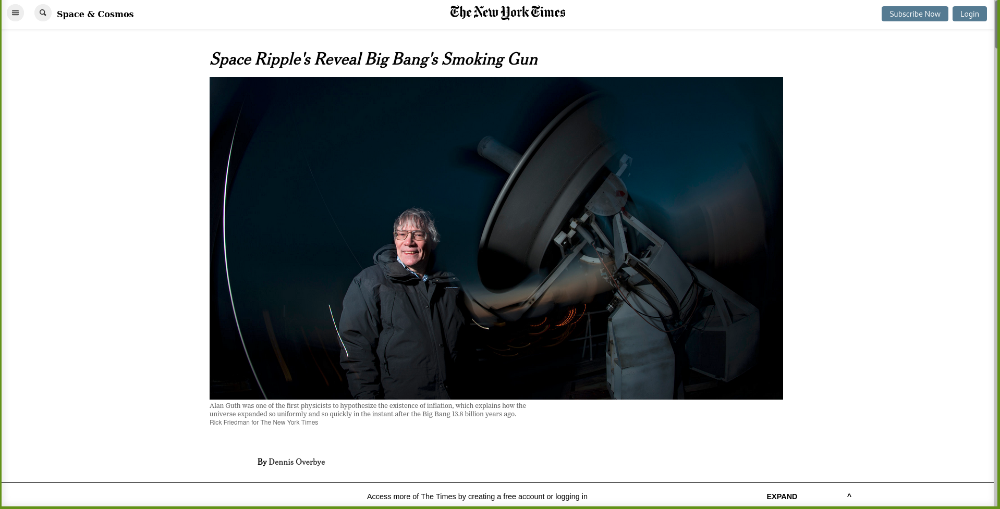

# NYT Clone

> This is a clone of the NYT [article](https://www.nytimes.com/2014/03/18/science/space/detection-of-waves-in-space-buttresses-landmark-theory-of-big-bang.html) made using HTML and CSS. We've used flexbox, grid and float to position all the different elements.

## Built With

- HTML
- CSS3
- Git & GitHub

## Live Demo

[Live Demo Link](https://apricot12.github.io/nyt-clone/)

## Authors

👤 **Author1**

- GitHub: [@apricot12](https://github.com/apricot12)
- Twitter: [@apricotfoxtrot](https://twitter.com/apricotfoxtrot)

👤 **Author2**

-- GitHub: [@githubhandle](https://github.com/bashforger)
- Twitter: [@twitterhandle](https://twitter.com/bashforge)
- LinkedIn: [LinkedIn](https://linkedin.com/muhammad-adeel-danish/) 

## 🤝 Contributing

Contributions, issues, and feature requests are welcome!

Feel free to check the [issues page](issues/).

## Show your support

Give a ⭐️ if you like this project!

## Acknowledgments

- New York Times
- Google Fonts

## 📝 License

This project is [MIT](lic.url) licensed.
